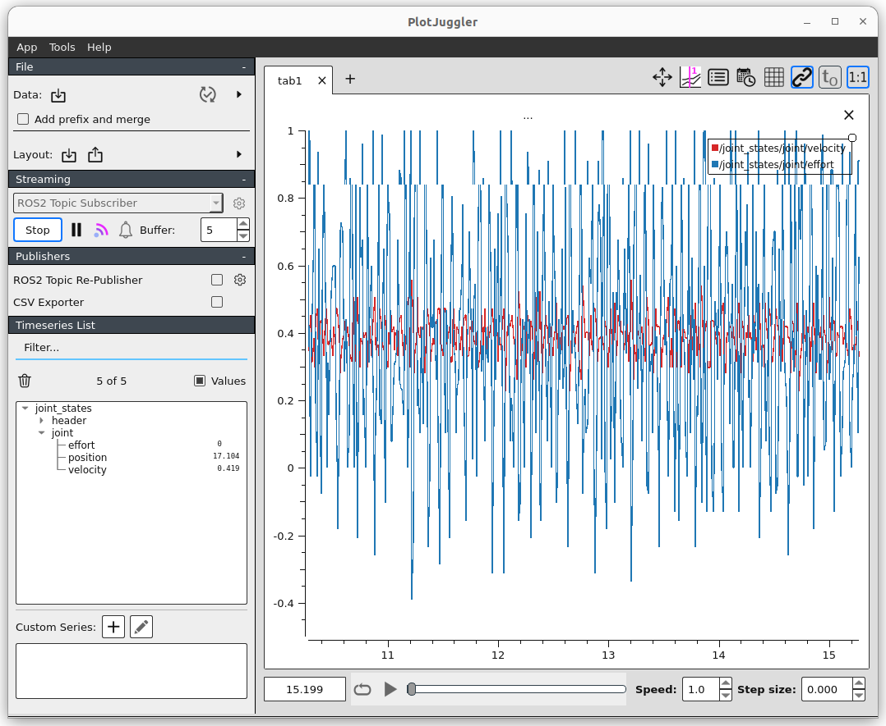
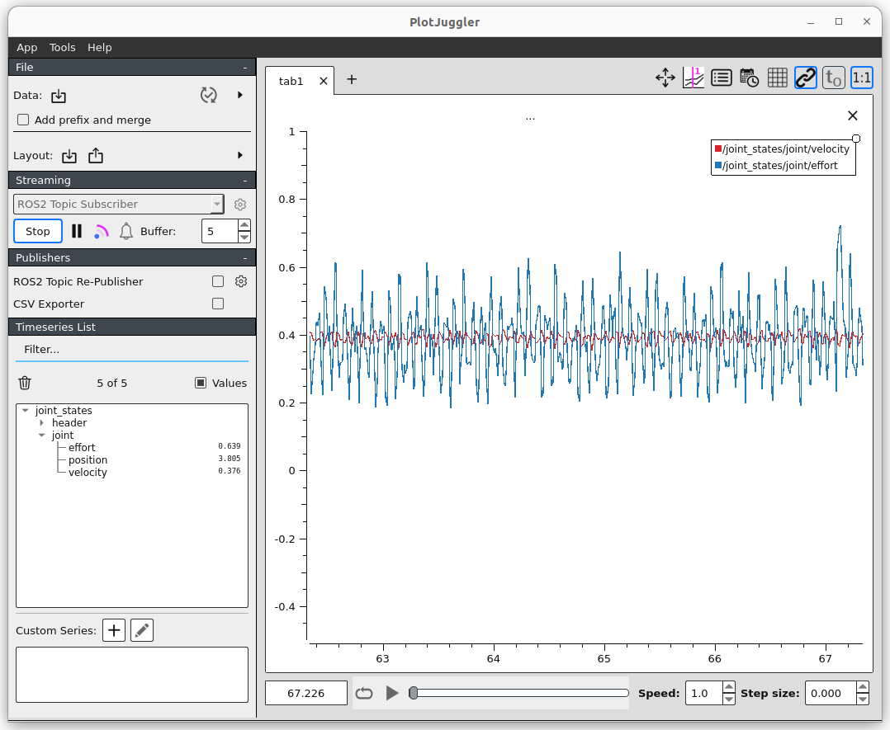

# rmd_hardware_interface

`rmd_sdk`를 ROS 2 `ros2_control` actuator interface로 연결합니다. `robot_arm_description`의 각 RMD 관절은 아래 pluginlib 식별자를 사용합니다.

```xml
<plugin>rmd_hardware_interface/MyActuatorRmdHardwareInterface</plugin>
```

관절별 CAN interface, actuator ID, 속도 제한과 timeout은 URDF/Xacro의 hardware parameter로 전달됩니다. 일반적인 관절 추가는 이 패키지가 아니라 `robot_arm_description`과 `robot_arm_bringup`에서 수행합니다.

## Upstream documentation

### MyActuator RMD X-series Hardware

Author: [Tobit Flatscher](https://github.com/2b-t) (2024)

[](https://opensource.org/licenses/MIT)


## Overview
This package holds the [**`ros2_control` integration**](https://control.ros.org/humble/index.html) for the [**MyActuator RMD-X actuator series**](https://www.myactuator.com/rmd-x) in the form of a [hardware component](https://control.ros.org/master/doc/ros2_control/hardware_interface/doc/hardware_components_userdoc.html). The hardware interface is based on the [C++ driver that I have written for these actuators](https://github.com/2b-t/myactuator_rmd).

For using it add the following lines to your URDF refering to the joint of interest `joint_name`:

```xml
<ros2_control name="${some_name}" type="actuator">
  <hardware>
    <plugin>rmd_hardware_interface/MyActuatorRmdHardwareInterface</plugin>
    <param name="ifname">${ifname}</param>
    <param name="actuator_id">${actuator_id}</param>
    <param name="torque_constant">${torque_constant}</param>
    <!-- Optional: Low-pass filters for velocity and effort (0 < alpha <= 1); defaults to no filter -->
    <param name="velocity_alpha">0.1</param>
    <param name="effort_alpha">0.1</param>
    <!-- Optional: Cycle time of the asynchronous thread; defaults to 1ms (1000Hz) -->
    <param name="cycle_time">1</param>
  </hardware>
  <joint name="${joint_name}">
    <command_interface name="position"/>
    <command_interface name="velocity"/>
    <command_interface name="effort"/>
    <state_interface name="position"/>
    <state_interface name="velocity"/>
    <state_interface name="effort"/>
  </joint>
</ros2_control>
```

The `ifname` has to correspond to the name of the CAN interface as shown by `$ ifconfig` (e.g. `can0`) and the `actuator_id` to the ID of the actuator (e.g. `1`). The `torque_constant` is required for controlling the actuator over its effort interface and depends on the actuator type. Furthermore optional [low-pass filters](https://en.wikipedia.org/wiki/Low-pass_filter) (by means of the filter coefficient `alpha`) for the read velocity and effort can be activated. The correlation between the ratio of [sample](https://en.wikipedia.org/wiki/Sampling_(signal_processing)) (in our case the update rate of the hardware interface) and [cut-off frequency](https://en.wikipedia.org/wiki/Cutoff_frequency) is given by `sample_frequency/cutoff_frequency = (1-alpha)*2*pi/alpha`. For `alpha = 0.07` this ratio corresponds to `125`, meaning if the hardware interface is running at 1000 Hz any oscillations with a higher frequency than around 8 Hz will be filtered out.

| Without low pass filter (corresponds to `alpha = 1.0`)       | With low pass filter (`alpha = 0.07`)                        |
| ------------------------------------------------------------ | ------------------------------------------------------------ |
|  |  |

Similarly the cycle-time for the asynchronous thread interfacing the actuator through CAN can be specified. For examples refer to the `rmd_sdk_description` package.
